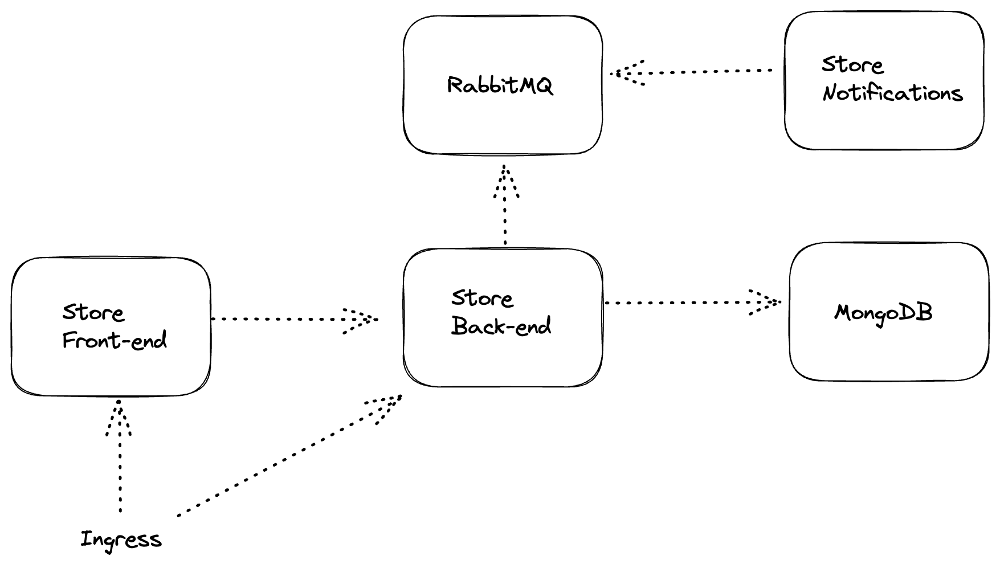

# K8S microservices deploying to AWS EKS

## Architecture Diagram


## AWS EKS

### Install eksctl
    ```
    brew tap weaveworks/tap
    brew install weaveworks/tap/eksctl
    eksctl version

    ```

### Create cluster using eksctl 
`eksctl create cluster --node-type t2.medium`

eksctl automatically switch the cluster context. But make sure you're in the right context.
`kubectl config get-contexts`
`kubectl config use-context <context-name>`

## MongoDB Atlas Operator
```
chmod +x ./k8s/atlas/atlas-operator.sh
./k8s/atlas/atlas-operator.sh --org_id <org_id> --atlas_public_key <atlas_public_key> --atlas_private_key  <atlas_private_key> --mongo_pw <mongo_pw>
```

### MongoDB connection string
Wait until the cluster spun up and run below command.
`kubectl get secret k8s-micro-cluster0-mongok8s -o json | jq -r '.data | with_entries(.value |= @base64d)'`

## RabbitMQ Cluster Operator
```
chmod +x ./k8s/rabbitmq/rabbitmq-operator.sh
./k8s/rabbitmq/rabbitmq-operator.sh --aws_access_key_id <aws_access_key_id> --aws_secret_access_key <aws_secret_access_key> --from_email <from_email>
```

```
username="$(kubectl get secret rabbitmq-cluster-default-user -o jsonpath='{.data.username}' | base64 --decode)"
password="$(kubectl get secret rabbitmq-cluster-default-user -o jsonpath='{.data.password}' | base64 --decode)"
echo "username: $username"
echo "password: $password"
```

## K8S resources

`kubectl apply -f ./k8s/ingress/ingress-aws.yml`

Creating AWS ingress produces load balancer. `kubectl get all -n ingress-nginx`. Copy the LB URL and paste into `ingress-service.yml` host field.

```
kubectl apply -f ./k8s
kubectl apply -f ./k8s/ingress/ingress-service.yml
```

## Create the product in MongoDB
```
curl --location '<load-balancer-url>/api/products' \
--header 'Content-Type: application/json' \
--data '{
    "name": "Hoodie",
    "description": "Nice to wear",
    "price": 20,
    "image": "https://images.unsplash.com/photo-1618354691373-d851c5c3a990"
}
'
```


